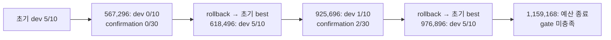

# v8 내부 코드·로그 분석 결과

작성: 2026-09-27 KST · 요청: [02_internal_code_log_analysis_request.md](02_internal_code_log_analysis_request.md)

## 결론과 조사 범위

**v7의 23개 실제 run, 최종 checkpoint, manager가 지정한 1,380경기, v6 rollback 기록을 로컬 원본에서 다시 확인했다.** 이전 감사 수치를 기대값으로 사용하지 않았다. 현재 가장 먼저 해결할 것은 terminal 점수·승자 계약과 진단 계측이다. A2/A3의 동일 결과에는 별도의 구체적인 기전도 확인됐다. 서로 다른 graph와 학습 가중치임에도 최종 graph residual의 모든 correction logit 상한이 KEEP logit보다 낮아, 현재 greedy 경로에서는 수정 행동을 선택하지 못한다.

| 구분 | 이번 조사에서 확인한 내용 | 의사결정 |
|---|---|---|
| 반드시 고칠 결함 | final score 보존 부재, reward 부호 기반 winner, 마지막 score delta 누락 가능성, TimerManager 재진입, 평가 intervention 전달 누락, 경로 실패의 팀 전체 전파, 시점이 지난 checkpoint 불변성 테스트 | D01/D08 선행. 수정 빌드·평가 결과는 별도 ID로 남긴다. |
| 검증 후 바꿀 설계 | residual 학습 sampling/평가 greedy 불일치, 한 슬롯 한 프레임 개입, F1 heading·합법 vector 입력, 실제 step 기준 train 분포 | 행동·이동·보상 trace를 확보한 뒤 최대 3개 소규모 진단으로 좁힌다. |
| 지금은 보류 | graph 확대, 전뇌 본선 채택, 장기 sweep, 임의의 action duration 고정, 관측에 없는 battery 수량 추가, export 차단만 제거 | 현재 자료는 성능 개선·인과 효과·제출 가능성을 입증하지 못한다. |

새 장기학습, 원본 checkpoint resume, 새 대량 평가, upstream 교체, 실제 Unity 실행은 하지 않았다. 기존 train/dev와 v6 confirmation 기록, 저장 가중치의 오프라인 계산, 합성 fixture, 현재 회귀 테스트를 사용했다. 독립 최종 test의 경기 내용·seed를 설계 선택에 사용하지 않았다. split manifest는 hash만 확인했다. 원본 코드·로그·가중치는 변경하지 않았으며 새 파일은 이 요청 디렉터리 아래에만 작성했다.

증거 등급은 **소스 확인 / 기존 원시자료 재집계 / 합성 재현 / 실제 Unity 재현 / 문서상 보고 / 가설 / 자료 부재**로 구분한다. 이번에 새로 수행한 실제 Unity 재현은 **0건**이다. 기존 Unity 보고를 다시 읽은 것은 새 실험으로 세지 않는다. 아래 `winner`·승률은 별도 표시가 없더라도 **기존 wrapper가 기록한 결과**이며 engine 정답으로 인증한 값이 아니다.

## 제출물과 재실행 방법

| 요청 산출물 | 파일·내용 |
|---|---|
| artifact_inventory | [전체 manifest](internal_analysis/artifact_inventory.json), [23-run 색인](internal_analysis/run_inventory.md), [저장소·원자료 검증](internal_analysis/provenance_verification.json) |
| root_cause_evidence | 아래 문제 카드 C01–C10 및 F01–F36 판정표, [카드 JSON](internal_analysis/root_cause_evidence.json). 소스·실행 식별자·기대/실제·반증·완료 조건 기록 |
| event_timeline | [v6 전체 update·사건·rollback 전후](internal_analysis/event_timeline.json), [v7 update 집계·100k 구간](internal_analysis/training_summary.json) |
| behavior_audit | [graph bound·가중치 변화](internal_analysis/behavior_audit.json), [F1 활동](internal_analysis/direct_diagnostics.json), [실패/정상 사례](internal_analysis/case_traces.json), [v3 confusion](internal_analysis/v3_replay_audit.json) |
| minimal_repros | [실행 코드](internal_analysis/minimal_repros.py), [결과](internal_analysis/minimal_repros.json), [stdout](internal_analysis/minimal_repros_output.txt), [회귀 테스트 원문](internal_analysis/regression_tests.txt) |
| v8_decision_inputs | 마지막 D01–D08 결정표와 [JSON](internal_analysis/v8_decision_inputs.json), 진단 후보 3개, 외부 확인 요청·계측·완료 조건 |

프로젝트 루트에서 아래 명령으로 재집계할 수 있다. 첫 세 명령은 로컬 원본을 읽고 `internal_analysis/`의 분석 산출물만 갱신한다. 최소 재현의 SGD는 합성 모델에 대한 메모리 내 1회 update이며 학습 checkpoint를 쓰지 않는다.

```bash
.venv/bin/python v8_research_requests_2026-09-27/internal_analysis/analyze.py
.venv/bin/python v8_research_requests_2026-09-27/internal_analysis/supplement.py
.venv/bin/python v8_research_requests_2026-09-27/internal_analysis/finalize_analysis.py
.venv/bin/python v8_research_requests_2026-09-27/internal_analysis/minimal_repros.py
.venv/bin/python -m unittest discover -s tests -v
.venv/bin/python v8_research_requests_2026-09-27/internal_analysis/verify_delivery.py
```

입력 hash: [주 분석](internal_analysis/input_hashes.json), [추가 분석](internal_analysis/supplement_input_hashes.json), [통계·소스·원자료](internal_analysis/finalize_input_hashes.json). 실행 환경: Python **3.10.12**, NumPy **1.23.5**, PyTorch **2.13.0**. [실행 metadata](internal_analysis/audit_execution.json)에 명령·branch·HEAD가 있다. hash는 SHA256이며 표시용 축약값의 전체 값은 JSON에 보존했다.

납품 검사: [원본 hash·JSON·링크 확인](internal_analysis/delivery_verification.json), [산출물 hash 목록](internal_analysis/output_manifest.json). `verify_delivery.py`가 카드/결정 JSON과 이 두 파일을 만든다.

## I00 — 실행물·버전·산출물

### 기준 snapshot과 현재 checkout

| alias | 실제 위치 | 확인한 commit / 상태 |
|---|---|---|
| `ROOT` | `/Users/safeailab_macmini/Desktop/2026-IST-tech-RL` | `RL-Agent-New` / `82ce2a1014c28b02408ef733c578a7ef367053cc` |
| `GAME` | `/Users/safeailab_macmini/Desktop/blackout` | `d2220a7d01be88d413f551efd529f4758833be8b`, clean |
| `API` | `/Users/safeailab_macmini/Desktop/blackout-env` | `6ba7d9993cf1bdefe1ed480c8efbcabcb923f539`, clean |

요청서의 `main@e6e98a63e9f401f6bf03e463a720c03878d1beb7` object는 현재 저장소에 없다. 따라서 그 snapshot과의 정확한 commit diff는 확인하지 못했다. 대신 **23개 checkpoint의 기록된 source fingerprint와 현재 해당 파일의 hash가 모두 일치**하는 것을 확인했다. 소스 hash 일치는 실행 산출물과 현재 분석 코드의 연결 증거이며, Unity 바이너리가 인접 소스에서 빌드되었다는 독립 증명은 아니다.

조사 시작 시 미커밋 변경은 사용자의 `.gitignore` 한 파일이었다. 이번 요청 디렉터리를 ignore하는 변경이며 그대로 보존했다. 기존 `issues/1st_issues_v0-v7.md`는 수정하지 않았다. 예전 README의 중단 시점 설명과 현재 완료된 manager 상태는 다르므로, 상태 판정에는 문서보다 실제 manager/result/checkpoint를 우선했다.

### 확보 범위와 일치 검사

| 항목 | 확인 결과 |
|---|---|
| v7 manager | `logs/v7/main_study/accelerated/summary.json`의 **23개 run 전부 완료**, 각 2,000,000 env step |
| 실험 구성 | A0 MLP / A1 parameter-matched MLP / A2 degree-preserving rewired / A3 원 graph: seed 11·22·33·44·55. F1 전뇌 readout: 11·22·33 |
| 평가 | run당 dev 30 map × 양 진영 = 60경기. manager가 가리킨 result만 집계, progress·백업·다른 평가를 중복 합산하지 않음 |
| final checkpoint | 23개 `checkpoints/latest.pt` 및 평가 시점 immutable copy 23개 확보. 각 result의 checkpoint hash와 일치 |
| provenance | 23개 config, graph NPZ/metadata, build, opponent, split hash 모두 등록값과 일치. final ckpt hash 23개·result 파일 hash 23개 모두 고유 |
| 입력 graph 원자료 | FAFB 2개·MaleCNS 4개 파일을 직접 streaming hash 재계산: source manifest와 **6/6 일치** |
| frozen opponent/encoder | `checkpoints/win_70_vs_scripted.pt`, SHA256 `c6265abd1f8e51ce5fad641ab87c8323ed05e412bd4cf03b728454bb8d1c34d9` |
| Unity executable | `builds/BlackOut.app/Contents/MacOS/RLGame2026`, SHA256 `49172f88b1ba2429677e7ec4a7876c4589876090be4888aeaef39269e29f4a69` |
| runtime overlay | 별도 registration에 82파일, **82/82 일치**. runtime hash `7917ee4ace84288ca61fb753f57b999184d190850459307f79868f76f979de60` |
| 중간/초기 checkpoint | v7의 일반적인 step-0·중간 snapshot은 없음. 예외: 가속 전 A2/11 step 147,456 백업, 완료된 A0/11·A1/11 step 2M 백업 |
| v6 | training 566 update, completed episode 226개, target dev 25개, 두 rollback/confirmation, run summary, checkpoint 11개 확보. rollback 직전 567,296·925,696 전용 snapshot은 없음 |
| v3 | 최종 step 3,000,320 checkpoint의 마지막 teacher replay 100,000개와 training 로그 확보 |

각 run의 experiment ID, 상대/graph/config/build/source hash, 첫·마지막 update의 UTC 시각, 상태·runtime·resume event·partial episode는 [artifact_inventory](internal_analysis/artifact_inventory.json)에 있다. 절대 경로가 들어 있는 과거 runtime metadata는 위 alias로 치환할 수 있고, 새 색인은 `ROOT` 상대 경로를 사용한다. 첫 update 시각은 프로세스 시작 시각이 아니며, 마지막 update는 평가 종료 시각이 아니다.

**재개 이력:** A2/11만 미완료 checkpoint step 147,456에서 이어 학습했다. 18,720 step의 진행 중 episode를 버리고 새 물리 상태에서 시작했다. A0/11·A1/11은 가속 도입 전 이미 2M 완료여서 훈련 checkpoint lineage가 비어 있다. 이 두 run의 `acceleration_runtime.json`을 보고 전체 훈련이 가속 경로였다고 해석하면 안 된다. 물리 상태 없는 재개는 bitwise 연속 재개가 아니다.

## I01 — 점수·승자·종료·보상

### 원본 1,380경기 재집계

| 모델 | 경기 | 승 / 무 / 패 | 0:0 기록 | A 승 / 경기 | B 승 / 경기 | 길이 21,003 |
|---|---:|---|---:|---|---|---:|
| A0 | 300 | 46 / 1 / 253 | 267 | 34 / 150 | 12 / 150 | 68 |
| A1 | 300 | 65 / 6 / 229 | 260 | 44 / 150 | 21 / 150 | 84 |
| A2 | 300 | 150 / 0 / 150 | 270 | 60 / 150 | 90 / 150 | 90 |
| A3 | 300 | 150 / 0 / 150 | 270 | 60 / 150 | 90 / 150 | 90 |
| F1 | 180 | 32 / 0 / 148 | 144 | 14 / 90 | 18 / 90 | 31 |
| 합계 | **1,380** | **443 / 7 / 930** | **1,211** | — | — | **363** |

0:0인데 winner가 있는 기록은 **1,204개**, 나머지 7개는 wrapper draw다. score 범위는 0–0.05999999866, 음수·1 초과는 0개다. 정규화 단위에서 최대 0.06이라는 사실은 최종 6점이라는 인증이 아니다. 경기 길이는 627–21,003이며, **길이 21,003만으로 timeout reason을 확정하지 않았다.** 근거: [전체 cube](internal_analysis/evaluation_cube.json), [분포](internal_analysis/evaluation_summary.json).

| 지표 | 현재 사용 판정 | 이유 |
|---|---|---|
| terminal `score_0/score_1`, 최종 점수차 | **사용 불가** | engine final snapshot 없이 terminal/reset 관측 값을 저장. 0이 아닌 값도 정답 보장 없음 |
| last-nonterminal score | **제한 사용** | 종료 전 상태 설명에는 유효하나 마지막 득점·감점은 빠질 수 있음 |
| wrapper `winner`, win rate | **제한 사용** | 과거 실행 비교·재현 지표. terminal reward 부호 기반이며 engine winner 독립 검증 없음 |
| 공식 예제 match의 누적 reward 승자 | **게임 승패 지표로 사용 불가** | shaping 합계 비교로 승자를 정하며 점수/종료 event와 다른 정의 |
| env step 수·등록 hash·파일 일치 | **사용 가능** | 로그/파일에서 직접 확인. step 수를 game seconds로 바꿀 때 dt 계약은 별도 필요 |
| timeout 발생률 | **현재 산출 불가** | 종료 reason·timer ID 누락. watchdog은 게임 timeout과 다름 |
| score-delta reward | **제한 사용** | nonterminal 변화는 계산 가능, terminal 마지막 delta와 winner bonus의 정답성은 보장 안 됨 |

### C01 — terminal score·winner·마지막 reward 오염

- **ID/상태/등급:** F01–F03·F35 / I01 / D01, **미해결**, P0. 소스 확인 + 원시자료 재집계 + 합성 재현.
- **위치:** `ROOT/scripts/evaluate_v7.py:90`의 종료 분기; `API/blackout_env/env/blackout_env.py:_collect_obs:257` 및 winner 추론 `:297`; `API/blackout_env/competition/match.py:124`; `ROOT/blackout_rl/training_reward.py:TeamTrainingReward.__call__:55`, terminal 분기 `:73`; `GAME/Assets/Project/Runtime/Scripts/ML/BlackOutAgent.cs:54`. commit은 I00 표 기준.
- **기대/실제:** engine fixture 최종 [100,42] → 저장 [0,0]. 직전 tracker [97,42] → terminal delta [0,0], bonus [1,-1], 보존 점수 [97,42]. 다음 reset 후 0점 입력의 delta는 [0,0]이라 **가짜 reset 감점 방지는 동작하지만 마지막 +3점 복구는 하지 못한다**.
- **승자 반례:** engine draw로 둔 합성 `TerminalSteps`에 shaping +0.1을 주면 실제 `_collect_obs`가 winner 0으로 판정한다. 모든 과거 승자가 틀렸다는 뜻은 아니며, 기존 1,380경기의 실제 오분류 수는 알 수 없다.
- **추가 소스 결함:** Unity score handler는 `score > 0`만 보고 reward를 주므로 양수 점수의 감소도 같은 양의 자기팀 shaping handler를 호출한다. 다른 패널티가 상쇄할 수 있어 총 reward가 반드시 양수라는 주장은 하지 않는다.
- **실행·반증 자료:** `minimal_repros.json`의 `terminal_score`, `draw_plus_shaping_winner`, `score_delta`; 아래 8개 원본 사례. engine event와 비교할 자료가 없어 역사적 최종 점수는 임의 복원하지 않았다.
- **수정/완료 조건:** reset 이전 immutable final_score/final_winner/reason을 episode ID와 함께 확보; reward 성분과 마지막 delta를 정확히 1회 반영. 정상 득점·약탈·100점·동점+shaping·동시 event 각각 engine 정답과 저장값이 일치해야 완료. E01에 build별 이벤트·종료 순서 계약이 필요하다.

### 대표 원본 사례 8개

각 행의 실제 result 경로·row는 [case_traces](internal_analysis/case_traces.json)에 보존했다. `team` 0=A, 1=B. 현재 result에는 전후 observation frame이 없어 이 표를 frame trace라고 부르지 않는다.

| 모델 / train seed | map seed | team | steps | 저장 score A:B | wrapper winner | 확인되는 현상 |
|---|---:|---:|---:|---|---:|---|
| F1 / 11 | 41000 | 0 | 1,525 | 0:0 | 1 | 짧은 경기의 zero+winner |
| F1 / 11 | 41001 | 0 | 1,400 | 0:0 | 1 | 같은 현상, 다른 map |
| F1 / 11 | 41000 | 1 | 1,328 | .01:0 | 0 | nonzero도 최종점수 인증 불가 |
| F1 / 11 | 41004 | 1 | 953 | .04:0 | 0 | 위와 동일 |
| A1 / 11 | 41012 | 0 | 21,003 | 0:0 | -1 | wrapper draw |
| A0 / 33 | 41028 | 1 | 21,003 | 0:0 | -1 | 다른 모델의 draw |
| F1 / 11 | 41002 | 1 | 21,003 | 0:0 | 0 | timeout 길이 후보+winner |
| F1 / 11 | 41010 | 0 | 21,003 | 0:0 | 0 | timeout 길이 후보+winner |

### C02 — TimerManager 재진입

- **ID/상태/등급:** F04 / I01 / D01·D08, **미해결**, P0. C# 소스 확인 + 호출 순서를 옮긴 Python 합성 재현. 실제 Unity 연속 timeout 재현은 미실행.
- **위치/기전:** `GAME/Assets/Project/Runtime/Scripts/TimerManager.cs:Tick:52`, 특히 `:56`의 `timers[i].Tick(dt)` 콜백 안에서 clear/restart가 일어난 뒤 `RemoveAt(i)`가 새 타이머를 지운다.
- **기대/실제:** 합성 `[episode_old, absorb_old]` 완료 콜백이 `[episode_new, absorb_new]`를 만들었지만 최종 목록은 `[absorb_new]`. 새 EpisodeTimer가 사라진다.
- **영향·반증:** 자동 재시작 경로에 해당한다. Python 명시 reset이 Tick 종료 후 타이머를 다시 세우면 관측이 달라질 수 있다. 기존 모든 장기 episode를 이 버그 하나로 설명하지 않는다.
- **수정/완료 조건:** 완료 타이머의 identity 제거 또는 콜백 지연 큐 등 재진입에 안전한 생명주기 적용. 자동 재시작 3회와 명시 reset 3회 각각 episode ID·timer ID·생성/완료/삭제 시각을 남겨 모두 timeout 종료해야 한다. 외부 E01의 수정 build와 source→binary provenance 필요.

## I02 — A2/A3 동일 결과의 기전

### C03 — 학습한 graph residual이 greedy에서 항상 KEEP

**F09·F15 / I02·I07 / D02·D05, 미해결 설계 문제, P0 진단.** 소스·실제 final 가중치·수치 interval bound·합성 feature stress를 함께 확인했다. 경기 요약 동일성만으로 KEEP이라고 추론하지 않았다.

| 동일성 단계 | 판정과 증거 |
|---|---|
| 파일 | 다른 result 파일, 다른 SHA256. checkpoint 23개도 각각 다른 hash |
| graph | A2/A3 각각 205 nodes·7,820 edges; 공유 edge 2,173, 다른 edge 5,647. node ID·ports·in/out-degree는 동일 |
| load/config | final tensor의 src/dst가 각 지정 graph와 일치. config/source/hash 검증 통과. 평가가 다른 모델을 같은 파일로 읽은 증거 없음 |
| 파라미터 | 실제 final residual은 seed로 재구성한 초기 상태와 L2 10.329–11.749 차이. graph edge도 변함. frozen actor 변화는 20개 run 전부 0 |
| 분포 | final 10개 graph 모델 각각 합성 feature 96개에서 입력에 따른 확률 변화 있음. 학습 sampled 개입률도 서로 다름 |
| greedy 행동 | 아래 전 입력 correction 상한이 모두 음수이고 KEEP=0. 검증한 최종 inference 경로에서 항상 KEEP |
| 실제 이동 | 저장된 연속 평가 position trace 없음. 동일 observation·동일 planner 이력이라면 선택 action은 같지만 과거 물리 trace를 새로 복원한 것은 아님 |
| 경기 요약 | 10개 A2/A3 run의 60개 episode 배열이 모두 동일. 같은 60조건을 여러 번 수행한 결과이지 600개 독립 map이 아님 |

근거 소스: `blackout_rl/v7_1/model.py:GraphResidualHead.forward:33`, `blackout_rl/mappo_v6.py:V6Model.logits:93`, `V6Policy.act:211`, `scripts/evaluate_v7.py:60`. 원자료: [behavior_audit](internal_analysis/behavior_audit.json), [graph_comparison](internal_analysis/graph_comparison.json).

**상한 계산:** 모델은 매 decision마다 graph state를 0에서 시작한다. 각 round는 `h ← (1−leak)h + leak·tanh(W h + drive + bias)`이며 leak=.5, 4 rounds다. input port가 연결된 155개 node의 drive를 제한 없는 값으로 허용하고, tanh 범위와 W의 부호별 interval을 전파했다. 나머지 node도 interval로 계산하고 nonnegative pool 평균 및 마지막 linear head에 전파했다. round마다 node 경계 및 최종 출력에 `1e-4` 여유를 추가했다. 이는 **보수적인 수치 bound이며 부동소수점 연산 전체를 인증한 형식 증명은 아니다.** 가장 작은 margin도 약 .935로 여유보다 훨씬 크다. 법적 mask는 correction을 제거할 수만 있고 KEEP은 항상 허용되므로 이 결론을 뒤집지 않는다. 유한 입력과 현재 검증한 architecture·가중치에 한정한다.

| train seed | A2 최대 correction logit 상한 | A3 최대 correction logit 상한 |
|---:|---:|---:|
| 11 | -1.398370 | -1.000978 |
| 22 | -1.424785 | -1.203568 |
| 33 | -0.934818 | -1.544816 |
| 44 | -2.079234 | -1.286223 |
| 55 | -2.058894 | -1.909741 |

초기 correction bias는 `log(.1/(40×.9)) ≈ -5.886104`이며 KEEP은 0이다. 40개 수정이 모두 유효할 때만 초기 총 수정확률이 .1이다. **총 p_OVERRIDE가 .5보다 커도 40개 중 어느 한 correction도 KEEP을 이기지 못할 수 있다.** 합성 stress에서도 그런 입력이 각 모델에 존재했다. 다만 96개 입력은 실제 observation 재생이 아니므로 그 비율을 경기 중 빈도로 해석하면 안 된다.

| 모델 | 2M 전체 step 가중 sampled 개입률: seed 11 / 22 / 33 / 44 / 55 | final greedy |
|---|---|---|
| A0 | .7805 / .8526 / .8060 / .8326 / .8005 | 실제 평가 frame별 비율 미저장 |
| A1 | .7574 / .7862 / .8058 / .7171 / .7316 | 실제 평가 frame별 비율 미저장 |
| A2 | .3177 / .3081 / .3449 / .3221 / .3223 | 현재 final 모델·경로에서 0 |
| A3 | .4403 / .2868 / .3218 / .3604 / .2708 | 현재 final 모델·경로에서 0 |

초기 모델은 저장된 step-0 checkpoint가 아니라 **동일 seed·현재 일치 소스·frozen checkpoint로 재구성**했다. v7 중간 가중치가 거의 없어 언제 이 상태가 형성되었는지는 특정하지 못한다. final graph 모델과 동일 내부 planner를 같은 이력으로 실행할 때 action 분기는 없지만, 외부 pure-planner 새 평가를 실행한 것은 아니다. 최초 실제 평가 분기 episode/step도 기록 부재로 제출할 수 없다.

수정 후보는 선택 규칙과 학습 objective의 정합성 검증이다. 계층 gate로 **확률 표현만** 인수분해하고 기존 joint argmax를 유지하면 같은 결정이므로 해결되지 않는다. 총 개입률을 무조건 키우는 처방도 보류한다. A0/A1은 이미 높은 sampled 개입률에도 결과가 나쁘다. 완료 조건은 같은 chronological trajectory에서 planner·초기 residual·final·최소 변경안을 reset/이력까지 맞춰 비교하고, 유효 이동 및 검증된 승패가 개선되는 것이다. E02에 선택 규칙 대안과 비교 계약을 요청한다.

## I03 — PPO·회귀 event timeline

### C04 — 회복 rollback과 성능 개선을 구분

**F11·F13·F14 / I03 / D03·D06, 원인 일부 미검증, P1.** 소스: `blackout_rl/mappo_v6_training.py:update_v6:172`, `blackout_rl/v7_training.py:train:186`, `blackout_rl/v7_2/training.py`; 원본 `logs/mappo_planner_residual_v6/training.jsonl`. [event_timeline](internal_analysis/event_timeline.json)에 566 update와 rollback ±6,144 step 구간을 보존했다.

| v6 step | event / 관측 | 해석 |
|---:|---|---|
| 0 및 초기 평가 | target dev 5/10 | 이후 선택 기준이 되는 초기 상태 |
| 4,096 | balanced 단계 | 초기 2개 update는 PPO 없는 warmup |
| 55,296 | target mixture 전환 | 상대 분포 변경 |
| 157,696 | full win70 전환 | 이후 target 중심 |
| 567,296 | dev 0/10, confirmation 0/30, 첫 rollback | 초기 best 상태로 복원 |
| 569,344 | sampled 개입률 .166992 | 직전 .911621에서 급감 |
| 618,496 | dev 5/10 | 초기 수준 회복, 개선 증거 아님 |
| 925,696 | dev 1/10, confirmation 2/30, 두 번째 rollback | 다시 초기 best 상태로 복원 |
| 927,744 | sampled 개입률 .131348 | 직전 .891602에서 급감 |
| 976,896 | dev 5/10 | 초기 수준 회복 |
| 1,159,168 | stage budget 1,001,472 소진, gate 미충족으로 blocked | 수렴 판정이 아닌 예산 종료 |

25개 dev 평가 중 23개는 5/10, 위 두 회귀 시점은 각각 0/10·1/10이었다. **측정된 checkpoint에서 baseline 초과 개선은 발견되지 않았다.** 평가 사이의 일시적인 개선 가능성은 배제할 수 없다. v6 10경기와 v7 60경기는 서로 다른 평가 단위이므로 한 학습곡선의 연속 승률처럼 이어붙이지 않았다.

아래는 wall time이 아닌 학습 step 기준 사건도다. Mermaid 원문을 그대로 다시 렌더링할 수 있고, 모든 중간 update 수치는 event_timeline.json에 있다.



| rollback update | override | rollout mean_return | approx KL | clip fraction | gradient norm | explained variance |
|---:|---:|---:|---:|---:|---:|---:|
| 567,296 | .911621 | -.411198 | .002827 | .01550 | .60679 | -1.17717 |
| 569,344 | .166992 | -.14033 | .0000419 | 0 | .12174 | .36204 |
| 925,696 | .891602 | -.47568 | .003635 | .05945 | .67499 | .2632 |
| 927,744 | .131348 | -.14457 | .0001815 | 0 | .11783 | .45091 |

두 rollback 직전은 4 epochs·64 minibatches를 완료했다. 앞뒤 전체 loss·entropy·EV 등은 JSON에 있다. 높은 sampled 개입과 악화가 함께 나타나지만, 개입 자체의 인과 효과는 현재 기록만으로 분리할 수 없다. v6의 `teacher_failures`는 전 구간 0이어서, 아래 팀 전체 stop 결함을 v6 회귀의 주원인으로 지목할 근거는 없다.

v7은 모든 run에서 `early_stopped` 합계 0이다. update별 **평균** approx KL 최댓값은 A0 약 .0099, A1 .0073, A2 .00263, A3 .00288, F1 약 1.2e-7이다. 평균 gradient norm은 MLP 약 .51–.69, graph .13–.17, F1 약 .1 범위다. 이 수치들은 minibatch 평균이므로 단일 batch의 spike·gradient clipping 비율을 역산할 수 없다. A0/A1 중간 평가·checkpoint가 없어 최종 저성능이 시작된 update는 특정할 수 없다.

**gradient 반증:** GraphResidualHead의 zero-init output 때문에 첫 backward의 edge/bias gradient는 0이다. 합성 첫 update 뒤 두 번째 backward에서는 각각 .00330222/.0199128로 도달한다. 실제 최종 edge 가중치도 변했다. 따라서 ‘첫 gradient 0 → graph가 학습 내내 죽음’은 성립하지 않는다. frozen encoder의 delta 0은 의도된 동결이며 표현 충분성은 별도 가설이다.

**ratio/GAE 재검사:** 이번 suite에서 exploration 혼합을 포함한 behavior log-prob ratio=1 fixture, invalid mask 제외, v7 residual·F1 readout PPO ratio, collector episode 경계가 통과했다. `tests/test_ppo_training.py:127` fixture는 truncation의 bootstrap을 유지하되 다음 episode로 GAE를 흘리지 않아 `[5.95,5.5,1.0]`을 얻는다. 이는 합성 수식·저장 경로 검사이며 실제 원본 action/log-prob 전체 대조는 아니다.

부족한 값: 모듈별 gradient/parameter delta의 시간 이력, clipping 전후 norm, raw advantage/return 분산과 KEEP/correction별 분포, critic calibration, 동일 frame의 old log-prob·실행 action. 신규 ring buffer에 추가한다. 변경 완료 조건은 실제 행동 분기와 update를 연결해 회귀 이전 원인을 반증 가능한 형태로 좁히는 것이다. E03/E06/E07에는 budget 종료와 convergence 구분, 선택 규칙·효과크기 합의가 필요하다.

## I04 — 개입 효과·지속성·보상 지연

### C05 — 한 슬롯 한 frame 제어의 효과는 아직 식별되지 않음

**F10·F13 / I04 / D02·D03, 미검증, P1.** `blackout_rl/mappo_v6.py:apply_joint_action:188`은 한 decision에 최대 한 슬롯의 방향만 바꾸고, 다음 frame에는 planner가 다시 계산한다. nominal game dt=.02초이므로 1·5·25·50·250 step은 .02·.1·.5·1·5초지만, 실제 event time과 step 계약이 맞는지 함께 기록해야 한다.

기존 v6/v7 residual에는 고해상도 연속 requested action·position·goal·score event trace가 없다. 따라서 ‘다음 frame 되돌림’, 유효 개입 지속시간, deposit/전투까지의 reward 지연분포, ping-pong·협력 실패 비율은 **산출하지 않았다**. `episodes.jsonl`의 총 이동량만으로 이를 복원할 수 없다.

F1은 seed당 20,000개, **100 global step 간격**의 진단 sample이 있다. stationary sample 비율은 seed 11/22/33에서 .1363/.1259/.1265다. 이 중 nonzero requested지만 움직이지 않은 수는 452/409/207개(각 전체 sample 20,000개 기준)다. 한 cell보다 큰 displacement sample은 1/5/2개로 respawn/reset 가능성이 있으므로 빠른 실제 이동으로 계산하면 안 된다. nonzero requested지만 움직이지 않은 사례와 정상 소이동 사례의 앞뒤 진단 sample을 [case_traces](internal_analysis/case_traces.json)에 함께 남겼다. 앞뒤는 인접 frame이 아니라 100 step 간격이며, 벽 충돌과 다른 원인을 분리할 수 없다.

최소 진단은 같은 dev map/side에서 event-triggered ±250-step ring buffer를 기록하는 것이다. requested direction, 실제 위치 차, planner 다음 행동, goal/path 상태, 적재/충돌/죽음/score event를 연결하고 실패 유형별 **분모를 유효 decision 수로** 둔다. KEEP과 correction의 진짜 동일 상태 반사실은 Unity physics·환경/정책 RNG·상대·policy state snapshot이 있어야 한다. 없으면 episode-level paired 비교로 제한한다. 우선 duration을 늘릴 근거가 나오는지 확인하고, 장기 credit 문제만 남을 때 value/return 설계를 변경한다. E02/E03에 상태 복원 가능성과 최소 비교안을 요청한다.

## I05 — planner·관측·mask·전략

### C06 — PathNotFound 전파 및 기하 mask 한계

**F05–F08·F12·F36 / I05 / D04·D06, 일부 미해결·일부 수정됨, P1.**

| 경로 | 기대 / 실제 | 현재 증거·빈도 |
|---|---|---|
| `PlannerFeatures.prepare:114`, catch `:128` | 한 슬롯 실패를 격리해야 하나 planner 전체 reset + 5슬롯 모두 zero action | 실제 함수를 통과하는 합성 예외 주입: 정상 5개 이동 → 실패 시 0개. KEEP 여전히 valid. v6 실제 failure count=0 |
| `v7_2/teammates.py:ScriptedTeammates.act:25` | 제어되는 brain 슬롯은 scripted 목표 배정에서 제외, 동료 경로 실패는 지역 처리 | 이번 `tests/v7/test_teammates.py`에서 과거 실패와 수정 동작 fixture 모두 확인 |
| `PlannerFeatures.prepare` mask | fixed speed `9×.02/24`, half/full endpoint 및 ±.014 margin 사용 | 실제 class·buff·반경·동적 접촉 전부를 모델링하지 않음. true physics 기준 없어 FP/FN 수치 산출 불가 |
| KEEP | 항상 valid | 위험한 planner 방향을 그대로 유지하는 상황은 차단하지 않음. 이는 설계상의 fallback이며 유효성 인증 아님 |

수정 제안: 실패 슬롯만 fallback하고 다른 슬롯의 state/path를 보존한다. mask reason을 wall/boundary/role/shrine/duplicate로 구분하고, Unity의 실제 collider·속도·buff 조건과 비교할 진단을 둔다. 반증 조건은 실제 경로 실패가 없거나 개선 후에도 행동·승패가 동일한 경우다. 완료 조건은 분리된 슬롯 실패 fixture와 target 상대의 seed×side×role×location 빈도 비교다. 현재 그 고차원 failure cube를 채울 좌표·goal 로그가 없다. `training_exposure_cube.json`의 패배 수는 path failure 수가 아니다.

### 맵·관측·전략 판정

- **맵/cache:** wall 구조와 warehouse 후보 좌표, 현재 활성 warehouse를 분리해야 한다. 현재 scene에서는 후보 5개 중 4개와 고정 영역을 사용하며 반대 팀은 y=x 대칭이다. 후보는 모두 한 타일이 아니다. 예컨대 2×2, L형, 5×1 영역이 있어 ‘정확히 단일 tile 비활성’이라는 과거 답변을 현 코드에 그대로 대입하면 안 된다. class 기본값과 scene 설정도 다르다. seed가 바뀌면 활성 storage를 다시 읽어야 한다.
- **좌표:** semantic image의 Y는 top-down, game position은 bottom-up이다. 진영 변환은 x/y 교환이며 180도 회전이 아니다. 이번 합성 방향·wall fixture 통과는 실제 맵의 90도 회전 대칭을 증명하지 않는다.
- **semantic:** raw ID를 반올림해 one-hot으로 만드는 전처리는 이미 섞인 pixel을 복구하지 못한다. 합성 scaled ID `[1,1.5,2]`가 `[1,2,2]`로 바뀌어 one-hot 합은 모두 1이지만 의미는 오염될 수 있었다. item/unit/storage가 한 pixel에서 겹칠 때 단일 ID 우선순위 때문에 가려진 정보도 있다.
- **플랫폼 재현:** Xvfb/Graphics.Blit 보간 문제와 Windows 비재현은 사용자 제공·과거 보고다. 이번 Mac에서 실제 frame dump를 새로 비교하지 않았다. 같은 edge ROI의 raw ID·decoded ID·렌더 설정·OS/build hash가 필요하다.
- **정보 제공:** battery 존재와 stack quantity는 다르다. 현재 vector/graphic으로 수량을 복구할 근거가 없으므로 quantity는 unavailable이다. raw routing ID·자기 class·상대 class·held type도 각각 다른 계약으로 다룬다.
- **역사적 수정:** reset 중 숨은 초기 step, state/cache 초기화, v5 행동 개입 범위 문제는 현 adapter·fixture에서 수정 동작을 확인했다. 이를 현재 성능 회귀의 새 원인으로 재분류하지 않았다. 실제 여러 build의 reset 회귀는 별도 Unity 검사 대상이다.
- **특수 아이템/역할:** random/weak 상대에서의 BASE-S15 등 과거 포화·ablation 결과는 target 기여 증거가 아니다. 기존 집계와 보고는 참고 가능하나 target별 item event와 matched ablation trace가 부족하다. guard/worker 분담·아이템 로직 변경은 D06의 별도 요인으로 둔다.

## I06 — 정보 흐름·좌표·기억·시간

### actor/critic 정보 흐름

| 원 정보 | residual A0–A3 actor | F1 actor | critic / 판정 |
|---|---|---|---|
| vector 96: 위치·상태·held type·자기 class·score/time | frozen encoder의 128 latent로 간접 전달; 일부는 49 context에 명시 | retina 작성에 자기 xy만 사용, 나머지는 직접 전달 안 함 | central vector 123 + graphic 4×4×11 pooling = 299. 합법 actor 입력과 학습 전용 결합을 구분 |
| graphic 96×96×11 | frozen CNN 및 planner·mask에서 사용 | semantic retina 128×64 proxy, 270° FOV, max 48 semantic pixels(12 tiles) | critic에는 4×4 semantic 평균 pooling으로 전달 |
| planner action/goal/path 유무/role | 49 context에 명시 | 없음 | F1의 4 scripted 동료만 별도 planner 사용 |
| 상대·동료 상대 위치, nearest enemy | context에 명시 | retina를 통한 부분 정보 | 관측 범위·occlusion이 달라 동일 정보 대조군이 아님 |
| 이전 위치 차·stall | context에 명시, planner state도 유지 | brain state/history가 간접 기억 | residual graph 자체는 매 forward state=0 |
| score/time·흡수 phase | context·frozen latent로 전달 | 직접 입력 없음 | 같은 합법 vector를 추가하는 것은 정보 확장 실험 |
| heading | residual은 진영 정규화된 world 좌표 | retina에는 내부 heading 사용, readout에는 six rates만 입력 | 실제 body 방향 측정이 아니라 선택 action에서 갱신한 내부 변수 |
| battery stack quantity | unavailable | unavailable | 진단 engine 정보가 있어도 actor feature에 넣지 않음 |

49 context 구성은 `PlannerFeatures.prepare:147`부터: planner 2 + goal delta 2 + path/target 2 + role 3 + class 3 + self 상태/held 6 + phase 2 + score 2 + side 1 + displacement 2 + stall 1 + nearest delta/distance 3 + 10개 상대 위치 20 = 49. frozen latent 128과 합쳐 slot당 177이다. critic의 중앙 입력을 actor 관측 확장 허가로 해석하면 안 된다.

### C07 — F1 표현·heading 및 v3 학습 지표 혼동

**F07·F11·F18–F21 / I06 / D04, 병목 가설·일부 입력 누락 소스 확인, P1.** `v7_2/sensory.py:SemanticRetina.render:16`, `policy.py:features:37`, `commit_actions:70`, `decoder.py:ReadoutModel:10`, `dynamics.py:WholeBrain.step:55`.

F1은 자기 시점으로 렌더링하지만 readout은 6개 pool에서 **절대 8방향+NoOp**을 선택한다. heading sin/cos는 없다. 내부 heading은 선택한 절대 action으로 바뀌므로 충돌로 실제 이동하지 않아도 바뀔 수 있다. 다만 recurrent brain activity가 heading/history를 간접 부호화할 수 있어 ‘heading 정보 완전 소실’로 확정하지 않았다.

최소 대안은 (a) 상대 행동을 heading에 따라 world action으로 변환하거나 (b) readout에 합법 내부 heading sin/cos를 제공하는 것이다. 같은 자기 시점 패턴·다른 heading의 일관된 fixture와 chronological replay를 분리해 비교한다. 그 뒤에 held type/class/score/time의 직접 입력을 별도 요인으로 검증한다. encoder fine-tuning·memory 확대를 동시에 섞지 않는다.

시간 계약은 sensor refresh 5 steps≈.1초, brain tick 1 step≈.02초, output history 13 ticks≈.26초다. **13 tick window는 정확한 .26초 dead time이 아니다.** 4-node 합성 step response에서 첫 출력은 tick index 1에 이미 나타났다. 실제 MaleCNS cross-correlation·step response는 미실행. `gamma=.9995, lambda=.99`의 GAE 곱 .989505는 약 95-step e-fold 척도이고, gamma 단독은 약 2,000-step 척도다. 절대 기억 한계가 아니다.

**v3 replay 재집계:** 마지막 100,000 label은 slot당 20,000개, overall NoOp 41.358%. slot별 고정 난수 sample 512개, 총 2,560개에 최종 모델을 적용했다. 동일 훈련 replay이므로 독립 검증 accuracy가 아니다.

| slot / 역할 | 전체 label NoOp | sample accuracy | 이동 label만 accuracy |
|---|---:|---:|---:|
| 0 / worker | 6.475% | 21.484% | 22.917% |
| 1 / worker | 5.845% | 19.922% | 21.074% |
| 2 / worker | 6.130% | 16.016% | 16.633% |
| 3 / guard | 93.270% | 93.945% | 3.125% |
| 4 / guard | 95.070% | 95.313% | 7.692% |

overall sample accuracy는 49.336%다. guard의 높은 정확도가 worker 이동 판단을 가리는 구조다. 원 training의 warmup 마지막 step 100,352 accuracy는 .229004, peak는 step 36,864의 .964355로, 특정 높은 정확도 한 개를 endpoint 성능으로 인용하면 안 된다. confusion matrix는 [v3_replay_audit](internal_analysis/v3_replay_audit.json)에 있다.

replay에 map_seed·episode_id·env_step_id가 없어 trajectory/map 분리 probe, first divergence, teacher-forced vs closed-loop 복원을 할 수 없다. frozen/random/부분학습/raw-feature probe는 이 grouping이 있는 소규모 train/dev trajectory를 확보한 뒤 수행한다. label의 역할·held·stuck 정의도 사전에 고정한다. 성공 probe가 승률 개선 증명은 아니며 실패 probe가 정보 부재 증명도 아니다. E04에는 좌표 변환 대안과 leak-free probe 계획이 필요하다.

## I07 — connectome의 구조→활동→출력→행동→성능

### C08 — 구조 사용과 성능 기여 사이의 공백

**F16·F17·F20·F22–F24·F34 / I07 / D05, 일부 결함 미해결·성능 기여 미검증, P1.**

부분회로는 src/dst·ports·degree 확인, 4 rounds의 6개 output 도달성, 실제 edge 변화까지 확인했다. A2는 **rewiring seed 1729 하나**이며 학습 seed 5개가 graph control 5개인 것은 아니다. v7-1의 synapse count/transmitter는 생물학적 metadata로 있으나 실제 propagation은 무작위 초기화한 학습 signed edge weight를 사용한다. 따라서 생물학적 생리 재현보다 topology prior다. v7-2는 count/sign을 dynamics에 사용하지만 sensory proxy·coarse tick·pool/decoder 선택이 별도 가정이다.

| 연결 단계 | A2/A3 증거 | F1 증거 |
|---|---|---|
| 구조→계산 | 실제 graph buffer·degree/ports 검증 | whole graph artifact·raw source hash 검증 |
| 계산→활동 | 합성 gradient 도달 및 final weight 변화 | 저장 six-pool rate가 변함 |
| 활동→logits | synthetic feature에 따라 확률 변화 | seed 11의 최종 readout은 저장 rate 변화에 반응; 22/33은 argmax 고정 |
| logits→행동 | final greedy는 전부 KEEP | 아래 오프라인 replay에서 방향 편중 |
| 행동→성능 | graph 고유 성능 기여 증거 없음 | 동일 감각·slot·teammate의 작은 대조군이 없어 고유 기여 미검증 |

F1 six-pool sample은 seed당 20,000개다. pool mean 약 .018–.085, std 약 .029–.033, centered rank=6, singular-value entropy 기반 effective rank=5.9896–5.9917이다. six pools 전체가 무활동 또는 완전 동일 신호라는 가설은 지지되지 않는다. **전체 166,700 neuron population의 침묵·포화·진동 비율은 저장 자료가 없어 산출하지 않았다.** pool rank를 전체 brain rank로 확대 해석하지 않는다.

최종 F1 readout을 과거 training rates에 적용한 **오프라인 계산**:

| seed | greedy 출력 수 / 20,000 | bias-only 일치 | rate를 0으로 바꿨을 때 action 변화 | pool 역순일 때 변화 |
|---:|---|---:|---:|---:|
| 11 | South 5,931 / SE 14,069 | 29.655% | 14,069 | 4,270 |
| 22 | SE 20,000 | 100% | 0 | 0 |
| 33 | West 20,000 | 100% | 0 | 0 |

이는 학습 당시 sampled action도, 실제 최종 평가 trajectory도 아니다. 최종 모델에 역사적 상태 sample을 넣은 결과다. 방향 편중의 증거이나 OOD 차단과 배선의 고유 효과를 분리하지 못한다. readout은 6→9 linear의 **63 parameters**이고 critic 포함 전체 학습 parameter 109,888과 구분해야 한다. F1 훈련 entropy는 약 2.18–2.197로 ln9에 가깝다. 높은 sampling entropy와 greedy 방향 고정은 양립한다.

**원래 F0 gate:** 기존 256-step seed 3001/noise 30011 보고에서 normal 74 moved, frozen-frame 74 moved·action 차이 0, sensory-block 66 moved·차이 22, output-block 0 moved·차이 74였다. 이는 F0의 sensor/output 경로에 대한 제한된 증거다. 동적 frame이 반드시 필요하다는 증거도, 학습된 F1의 causal/performance gate도 아니다.

**평가 전달 결함:** `scripts/evaluate_v7.py:69`의 DirectPolicy 생성자는 controlled_slots/noise_seed/decoder_config만 넘기며 config의 intervention을 전달하지 않는다. train 쪽과 다르다. 합성 AST 검사가 누락을 확인했다. 현재 본실험은 normal이므로 이 결함을 현재 F1 저성능의 원인으로 단정하지 않지만, 앞으로 block/frozen 평가를 config만 바꿔 수행하면 normal로 실행될 수 있다. sensor_interval도 전달하지 않지만 현재 등록값과 default가 모두 5여서 지금 수치 차이는 없다.

또한 `policy.py:50`의 output_block은 **readout 전 rate를 0으로 만들 뿐**이다. 학습된 bias가 있는 F1은 action이 남는다. 합성 fixture에서도 `[1,0]` 이동이 나왔다. F1 진단에서 neural-feature block과 actuator block을 별도 이름·검사로 구분해야 한다.

완료 조건: 학습된 동일 F1에 normal/frozen-frame/sensory-block/neural-output-block/pool-shuffle을 정확히 전달하고 초기 brain/noise/slot/teammate를 맞춘다. 행동 분기 뒤 상태 분포가 달라진다는 점을 기록한다. 동일 감각·한 슬롯·같은 네 teammate를 쓰는 작은 MLP/RNN과 cost/performance를 비교한다. vector 추가 대조군은 별도 정보 확장 실험이다. 개선과 제출 비용이 확인될 때만 전뇌 본선 채택; 지금은 연구 분기로 보류한다. E05에는 복수 rewire·ports·동일 정보 대조 설계가 필요하다.

## I08 — 평가 통계·훈련 노출·일반화

### C09 — 공유 map·진영과 실제 step 노출을 보존해야 함

**F14·F25 / I08 / D06·D07, 통계/설계 제약, P1.** 원자료 cube: [평가](internal_analysis/evaluation_cube.json), [훈련 map×side×opponent](internal_analysis/training_exposure_cube.json), [partial 포함 노출](internal_analysis/exposure_summary.json), [paired 차이](internal_analysis/paired_statistics.json).

| 모델 | train seed별 승 / 60경기 | 평균 승률 | 완료 episode A 비율 | 실제 전체 env-step A 비율 |
|---|---|---:|---:|---:|
| A0 | 10, 12, 14, 5, 5 | 15.333% | 40.117% | 46.718% |
| A1 | 6, 13, 11, 15, 20 | 21.667% | 40.162% | 49.540% |
| A2 | 30, 30, 30, 30, 30 | 50.000% | 40.108% | 46.823% |
| A3 | 30, 30, 30, 30, 30 | 50.000% | 40.288% | 45.704% |
| F1 | 8, 12, 12 | 17.778% | 40.218% | 33.062% |

seed 순서는 11·22·33·44·55, F1은 앞의 3개다. draw는 A0 총 1개, A1 총 6개, 나머지 0개이며 seed×side별 수는 evaluation_summary에 있다. 정확한 step 집계에는 final partial과 A2/11의 discarded partial을 episode ID의 side cycle로 배정하여 각 run 2M과 일치시켰다. partial에는 상대 identity가 없어 그 부분은 unknown으로 남겼다. 완료 episode의 상대별 step을 전체 비율로 확대하지 않았다. v6에서는 update 227A/339B, partial discard 12건 합계 81,494 step도 별도로 확인했다.

episode 단위 A/B≈40/60 설정이 step 단위에도 그대로 적용되지는 않는다. F1은 B episode가 긴 등의 영향으로 A가 33.1%, MLP는 46.7–49.5%다. 현재 dev에서 B가 열세인 것은 A0/A1이며 A2/A3/F1에서는 같은 방향으로 나타나지 않는다. 모든 세대·모델에 공통된 B 열세라고 고정하지 않는다.

동일 train seed·map·side를 A2와 대응시킨 기록 비교:

| 모델 − A2 | 새로 이김 / 기존 승리 상실 / win 지표 불변 | 차이 | 참고 crossed bootstrap 95% 구간 |
|---|---|---:|---|
| A0 | 15 / 119 / 166, 총 300 | -34.667 pp | [-42.333, -26.333] pp |
| A1 | 18 / 103 / 179, 총 300 | -28.333 pp | [-36.667, -19.667] pp |
| A3 | 0 / 0 / 300 | 0 pp | [0,0] pp |
| F1 | 5 / 63 / 112, 공통 3 seed 총 180 | -32.222 pp | [-40.000, -23.333] pp |

이는 wrapper win이라는 제한된 지표의 **기술통계와 참고 구간**이며 engine 승리의 통계적 확증은 아니다. train seed 축과 map 축을 독립 복원추출하고, 각 map의 양 side·모델 대응을 보존하여 10,000회, 난수 seed 927로 계산했다. 독립성 가정은 train initialization과 평가 map이라는 두 축에 있으며 전체 300행을 iid로 취급하지 않았다. 공유 dev 선택·고정 상대·적은 train seed에 따른 불확실성을 이 구간이 모두 포괄하지는 않는다.

A2/A3의 기존 within-run CI [0.5,0.5]는 각 map의 양 side 평균이 모두 .5여서 bootstrap 입력에 변동이 없기 때문이다. 이번 차이 [0,0]도 대응 관측이 전부 동일하기 때문이며, 향후 map·다른 상대·구조 일반의 불확실성이 0이라는 뜻은 아니다.

v7 등록 본실험은 최종 budget의 latest를 평가하고 copy hash를 고정한다. v6 confirmation은 rollback/선택에 반복 사용했으므로 독립 최종 확인셋으로 취급할 수 없다. 과거 최종 test 접근 전체를 로컬 기록만으로 보장할 수는 없지만, 이번 조사는 열지 않았다. manager 지정 23결과에는 누락이 없으며 다른 중단 progress를 성공 결과로 세지 않았다. 다른 result의 존재와 숨은 시도 횟수 전체의 파악은 별개이며 외부 서버 실행 이력은 확보하지 못했다.

완료 조건은 D01의 올바른 승패, 사전 고정한 효과크기·paired 단위·train seed 수·튜닝 예산·best/latest 규칙을 E07과 합의하는 것이다. map 일반화와 고정 target 과적합, 상대/side 재배분과 구조 효과를 분리한다.

## I09 — 시간·재현성·회귀·제출

### 시간 분해와 측정 한계

아래 microbenchmark는 **기존 원자료**를 재확인한 값이며 이번에 새로 측정한 Unity/MPS 결과가 아니다. 등록 장비는 Mac16,11, CPU 12 cores(performance 8), 48GiB다. run별 torch_threads·동시 실행·backend는 resolved_config와 runtime 등록에 있다.

원자료는 `reports/v7/acceleration_baseline_profile.json`, `acceleration_baseline.json`, `acceleration_mps_comparison.json`이며 hash는 finalize_input_hashes.json에 포함했다.

| 측정 대상 | 기존 값 / 범위 | 해석 제한 |
|---|---|---|
| original collector cProfile 128step | 6.430s, 19.91 step/s | 비profile 28.45 step/s와 측정 구간도 달라 전부 profiling overhead로 볼 수 없음 |
| env.step cumulative | 4.085s | 아래 RPC 등을 포함하므로 합산 금지 |
| RPC / protobuf parse / pickle | 3.651 / 1.833 / 1.836s | call tree 중복 포함 |
| PlannerFeatures.prepare | 1.414s | scripted act .893s(상대 포함 256calls), opponent.act .515s, A* .460s와도 포함 관계 |
| frozen encoder | CPU 1.728ms / MPS+transfer 3.894ms | CPU 선택 근거. 전체 policy 지연은 아님 |
| whole graph CSR | CPU 19.101ms / MPS 5.150ms | 단일 연산 비교 |
| whole brain tick | CPU 20.854ms / MPS 7.136ms | retina/planner/환경/제출 loader 전체 비용이 아님 |

| 모델 | `sum(steps / collector_sps)` 추정 시간 / run | 첫～마지막 update 기록의 시각 차 / run |
|---|---|---|
| A0 | 12.39–17.26h | 12.48–17.27h |
| A1 | 12.29–17.27h | 12.39–17.28h |
| A2 | 12.61–14.13h | 13.37–15.28h |
| A3 | 12.65–13.96h | 13.40–14.81h |
| F1 | 11.00–11.42h | 11.08–11.50h |

위 표는 2M의 run별 기록이며 동시 실행을 합친 전체 wall time이 아니다. 두 열의 차이도 resume 중단·처음/끝 측정 경계·save·update 등이 섞여 순수 PPO 시간으로 볼 수 없다. F1이 빠른 것은 효율적으로 승리한다는 증거가 아니며 episode 길이와 구성도 다르다. checkpoint 저장·평가·cold start·mask·readout의 독립 timer, 단일 decision p95/p99, 정확한 launch→eval 종료 전체 wall time은 기록 부족으로 산출하지 않았다. 파일 mtime을 평가 소요 시간으로 대신하지 않았다.

### C10 — parity·테스트·export 미달 항목

**F26–F29·F31–F33 / I09 / D08, 통신 개선 확인·제출 미검증, P0/P1.**

일반 source fingerprint는 주로 `blackout_rl`과 v7 script를 추적하며 acceleration runtime은 별도의 82-file registration으로 추적한다. 둘 다 확인해야 overlay까지 포함된다. 기존 원래/가속 parity는 residual 512step, direct 256step이며 terminated/truncated hash가 전부 False인 배열과 일치했다. **두 구간 모두 종료 경계가 없다.** 짧은 구간 parity로 복수 episode/reset/resume의 동일성을 인정할 수 없다.

이번 명령은 앞의 `unittest discover`, 실행 시간 9.794초, **238 tests: 236 pass / 1 fail / 1 skip**이다. 과거 62개 통과와 별도 기록이다. `LiveUnityEvidenceTests` 등은 저장 증거를 읽는 테스트이므로 이번에 Unity를 실행했다는 뜻이 아니다. 일부 PPO update 테스트도 합성·mock collector를 사용한다.

실패는 `tests/v7/test_accelerated_runtime.py:64`의 `test_completed_and_stopped_main_checkpoints_remain_unmodified`다. A2/11 재개 전 latest hash `b81a3db5…`를 재개 후 latest `0ffd26c0…`와 비교한다. 전자는 147,456step, 후자는 2M이다. **pre_acceleration_backup은 원 hash와 일치하고 final lineage의 parent도 일치**하므로 이 실패만으로 원본 손상을 주장할 수 없다. 원본 백업 불변성과 정당한 후속 checkpoint lineage를 별도로 검사해야 한다. skip은 Metal device access가 필요한 실제 CSR 테스트다. 이번 조사에서 본체 테스트를 수정하지 않았다.

| 필수 regression | 이번 상태 | 다음 완료 조건 |
|---|---|---|
| terminal snapshot | 합성 반례 성립, 현 경로가 기대 계약 미충족 | engine 종료 event와 같은 episode 저장값 일치 |
| 정답 winner | draw+shaping의 실제 wrapper 반례 | score/engine reason과 모든 종료 사례 일치 |
| 마지막 delta | +3 누락 fixture, reset fake delta=0 | 마지막 증감을 정확히 1회 반영 |
| 연속 timeout | C# 순서의 Python mirror만 수행 | 자동/명시 reset 각 3회, 실제 Unity |
| graph/ckpt resolution | 실제 23run hash 일치, 합성 거부 검사 통과 | immutable 참조와 변경 탐지 유지 |
| sampled log-prob ratio/GAE | 합성 fixture 통과 | 실제 trajectory의 저장→실행 대응 추가 |
| mask | 합성 형태·방향·invalid 검사 통과 | 실제 collider/속도의 FP/FN 비교 |
| path failure 격리 | residual all-stop 반례, teammate 수정 fixture 통과 | residual도 지역 처리, 정상 slot 유지 |
| train/eval intervention | eval 인자 누락 탐지 | 각 조건이 entrypoint부터 policy까지 일치 |
| episode/step/reset | 합성 cache·replay·duplicate 검사 통과 | 공식 loader 연전에서도 일치 |
| acceleration parity | 기존 짧은 구간 일치, 종료·reset 없음 | terminal/복수 episode/reset/resume 경계 포함 |
| checkpoint lifecycle | 오래된 latest 비교로 1fail | immutable backup+parent lineage+final hash 별도 검사 |
| 독립 export | v6 합성 sequence/reset 통과, v7 disabled | 격리 loader에서 모든 의존성/state 검증 |

`scripts/export_v7.py:5`는 의도적으로 차단되어 있다. `API/blackout_env/model/loader.py:64`의 load와 경쟁 `match.py`의 호출은 확인했지만 연구용 F1의 명시적 episode_id/env_step_id/reset과 외부 graph 의존성이 그대로 허용된다고 확인할 수 없다. v6 이중 파일 export fixture 통과는 v7 인증이 아니다.

제출 진단 계획: 등록된 동일 checkpoint를 일시 격리 환경에 최소 artifact와 lockfile만 배치하여 공식 loader로 로드한다. observation dict 순서, 중복 호출, 연속 step, 2경기 이상 reset, cold load, 의존성과 외부 파일 접근, CPU/MPS 가용성·메모리·p95/p99를 측정한다. E08/E01에서 추론 제한·reset 통지·허용 의존성과 graph 동봉 계약을 확인한 뒤 합격 기준을 고정한다. export 오류 줄만 제거해서는 완료가 아니다.

fresh-clone 재현에는 git 외에도 I00의 build·frozen checkpoint·graph NPZ/JSON·source manifest·requirements lock·overlay 등록, 대상 run의 resolved_config/manifest/runtime/latest/evaluation copy와 로그를 같은 상대 위치에 복원해야 한다. raw connectome 전체는 학습된 추론에 필수는 아니지만 graph 추출 재현에는 필요하다. hash 일치 후 감사 script와 unit suite를 실행하며 원래 run의 재학습을 자동 시작하지 않는다.

## F01–F36 대응표

미검증은 문제 없음을 뜻하지 않는다. 수정됨은 대상 경로를 한정한다.

| F ID | 현재 판정 | 대응 |
|---|---|---|
| F01 | terminal score를 최종 점수로 사용 불가, 1,380건 재집계 | C01 / I01 |
| F02 | wrapper reward 부호·match 누적 reward 승자가 engine 정의와 다름 | C01 |
| F03 | reset 가짜 delta 방지는 동작, terminal 마지막 delta 누락 잔존 | C01 |
| F04 | TimerManager 재진입 소스/합성 확인, 실제 3연속 미실시 | C02 |
| F05 | wall 고정과 active 창고 가변 분리. 단일 tile 설명과 현 코드 차이 | I05 |
| F06 | 보간 후 one-hot 정상이어도 ID 오류 가능. 플랫폼 재현 미실시 | I05 |
| F07 | battery 수량 unavailable, 나머지 합법 정보도 경로마다 다름 | C07 |
| F08 | mask는 근사, 물리 FP/FN 미측정 | C06 |
| F09 | sampled/greedy 차이를 실제 가중치와 bound로 확인 | C03 |
| F10 | 1slot/1frame 소스 확인, 지속성의 실제 영향 미검증 | C05 |
| F11 | frozen delta=0 확인, 표현 충분성 미검증 | C04/C07 |
| F12 | residual all-stop 잔존, v7-2 teammate 지역 처리 수정 확인 | C06 |
| F13 | credit 지연분포 부재, GAE 계수만으로 원인 확정 불가 | C04/C05 |
| F14 | 고정 구조 비교와 분포 개선은 다른 목적. 실제 step 편향 확인 | C09 |
| F15 | 10run episode 동일. artifact 재사용 아닌 final greedy KEEP | C03 |
| F16 | 부분 graph는 topology prior. 생리적 의미 과대평가 금지 | C08 |
| F17 | rewiring seed 1개 | C08 |
| F18 | ego 입력/절대 출력, heading 간접 부호화 가능성 잔존 | C07 |
| F19 | F1에서 합법 vector 대부분이 readout까지 직접 전달되지 않음 | C07 |
| F20 | 고정 brain에 63param readout, 활동과 학습 자유도 구별 | C08 |
| F21 | sensor/tick/history 계약 확인, 실제 지연 미측정 | C07 |
| F22 | F0 causal gate를 F1 성능 증명으로 사용 불가 | C08 |
| F23 | 동일 정보·slot·teammate의 작은 모델 대조 미실시 | C08 |
| F24 | semantic retina·신경 dynamics proxy 가정 잔존 | C07/C08 |
| F25 | shared map/side/train seed 보존 cube·참고 통계 작성 | C09 |
| F26 | queue/protobuf/MPS 개선과 overlay 확인 | C10 |
| F27 | 짧은 throughput은 제출 policy p95/p99가 아님 | C10 |
| F28 | export 의도적 disabled, 해제만으로 인증 불가 | C10 |
| F29 | 명시적 state/reset 합성 확인, 공식 loader 연전 미검증 | C10 |
| F30 | 이전 감사에 없던 실제 로그·checkpoint를 이번 로컬에서 확보 | I00 |
| F31 | A2/11 partial discard, physics 미복원 resume 확인 | I00/C10 |
| F32 | 이번 238개 중 1fail/1skip. 실제 Unity 회귀 공백 명시 | C10 |
| F33 | 오래된 중단 문서와 완료 artifact 구별, 기준 commit object 부재 | I00 |
| F34 | evaluate intervention 인자 누락 확인 | C08 |
| F35 | 양수 score 감소에도 양의 reward handler, 총 reward 영향 미측정 | C01 |
| F36 | weak/random 아이템 ablation을 target 개선으로 일반화 불가 | I05 |

## v8_decision_inputs — 다음 변경 결정

| D ID | 내부 결론 / 외부 연결 | 선택과 채택 조건 |
|---|---|---|
| D01 | I00/I01/I08, E01/E07 | **계약·평가 수정 선행.** 올바른 final event→저장→reward가 연결되고 원래 기록과 별도 ID인 기준선이 갖춰질 때까지 승률로 설계를 선택하지 않음 |
| D02 | I02/I04, E02 | **residual 선택 진단.** A2/A3 final은 KEEP. 확률 표현만 변경해서는 부족. 유효 행동 차이와 paired 성적이 나오는 안만 채택 |
| D03 | I03/I04, E03 | **duration/credit 대규모 변경 보류.** 되돌림과 reward 지연 측정으로 지속성/value 중 우선순위를 결정 |
| D04 | I05/I06, E04 | **heading과 기존 합법 feature부터 소규모 비교.** 동일 정보 실험과 정보 추가를 구분. battery 수량 추가 금지 |
| D05 | I02/I06/I07, E05 | **connectome은 연구 분기.** 동일 slot/감각/teammate의 작은 대조보다 유용하고 cost/export도 충족할 때 본선 채택 |
| D06 | I03/I05/I08, E06 | **episode뿐 아니라 step 노출도 제어.** 특정 상대/side/role 실패 개선 증거가 있는 변경만 채택. 구조와 curriculum 변경 분리 |
| D07 | I00/I08, E07 | **paired map×side＋train seed의 독립 단위·효과크기·선택 예산 사전 고정.** 반복 confirmation을 holdout으로 취급하지 않음 |
| D08 | I09, E01/E08 | **공식 loader·reset·의존성·추론 제한을 통과한 구조만 후보.** 실제 연속 timeout/terminal parity와 격리 export 필요 |

### 계약 수정 후 진단 후보 3개

1. **residual 선택과 유효 개입:** pure planner, 재구성한 초기 residual, 실제 v7 final, 최소 선택 변경을 같은 dev 조건에서 비교한다. 먼저 연속 trace로 p_KEEP/max correction/margin/mask/sample/greedy/action/displacement를 측정한다. 강제 override 증가 자체를 성공으로 보지 않으며 개선이 없으면 gate 변경을 기각한다.
2. **F1 좌표·입력 대조:** 같은 1slot·4teammate·retina에서 heading 보정 두 안과 작은 readout 대조를 비교한다. normal 등 intervention 전달을 먼저 수정한다. score/time 등 vector 추가는 별도 실험이다. pool 활동만 달라지고 action/승패가 개선되지 않으면 본선 채택하지 않는다.
3. **실패 trace에 따른 지속성/credit:** 연속 ring buffer로 충돌·되돌림·목표 변경·deposit 지연을 분류한 뒤 duration 또는 value 중 한쪽만 소규모로 비교한다. 환경 snapshot이 없으면 episode paired 실험으로 명시한다.

각 진단은 소수의 기존 train/dev 조건·양 side에서 원래 build와 수정 build를 섞지 않고 수행할 계획이며, 이번에 새로 실행한 결과가 아니다. 장기 예산·최소 효과크기·중단 기준은 외부와 합의한 뒤 고정한다.

### 필수 추가 계측과 부족 자료

상시 counter/histogram과 실패 전후 ring buffer를 권한다. 모든 frame의 전량 저장은 필요하지 않다. 식별자는 run/config/code/build/ckpt/graph/opponent hash, train/map seed, episode/side/step/game time/update ID로 통일한다.

| 부족한 자료/계약 | 필요한 이유 | 다음 산출물 |
|---|---|---|
| engine final_score/winner/reason, terminal 전후 frame, timer ID | D01 정답·마지막 delta·연속 timeout | 같은 episode의 engine→wrapper→reward 비교 |
| chronological planner/mask/action/displacement/goal/event | I02/I04/I05 최초 분기·유효율·지연 | failure cube와 정상 대조 trace, slot/role별 분모 |
| old_log_prob/V/next_V/return/advantage, module gradient·clipping 비율 | PPO 회귀 시점과 기전 분리 | update 전후 재연 가능한 작은 batch |
| heading/sensor_refresh/tick/readout/rates/reset reason | F1 좌표·시간·실제 intervention 확인 | 같은 step의 정보 흐름과 step response |
| map/trajectory를 포함한 합법 feature replay | 누출 없는 표현 probe·v3 first divergence | map 단위 split의 probe/teacher-forced 대조 |
| 공식 loader/reset 통지/추론 시간/의존성·외부 파일 계약 | D08 합격 기준 | 격리 load→연전→자원 측정 |
| 요청 snapshot object, 외부 실행 이력, build provenance | 전체 diff·과거 선택/실험 횟수 감사 | commit/build/run 대응표 보완 |

이번에 확인한 것은 **평가 계약 반례, A2/A3 final greedy KEEP의 수치적 기전, 제어·검증 경로의 결함, 실제 데이터 노출과 F1/v3의 편향**이다. 저장되지 않은 전후 frame, engine 정답 승패, 물리 상태 반사실, 전체 population 활동, 실제 제출 지연은 복원했다고 주장하지 않았다. 각 설계 변경은 이 부족한 증거가 확보되는 조건에 연결했다.
